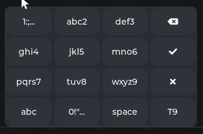

# LVGL T9 Keyboard Component

A custom T9-style keyboard widget for LVGL, supporting character cycling, symbol popovers, and helper buttons (space, backspace, OK, close, mode switching).

Is just similar to T9, no auto-completion.



## Features
- T9-style input for touchscreens
- Long-press popover for symbols
- Helper buttons for space, backspace, OK, close, mode toggle
- Easy integration with LVGL textareas

This was designed for a screen with 320px width, it seems to work "alright" down to 200px, but lower than that and it will not work that well.

The height of the parent container used was 200px.

## Usage
1. Add this repo as a submodule or external component:

```sh
git submodule add git@github.com:arturv2000/lv_keyboard_t9.git external/lv_keyboard_t9
```

2. Add `src/` and `include/` to your build system (CMake, PlatformIO, etc).
    - for example in CMake...

```cmake
add_subdirectory(lv_keyboard_t9)
list(APPEND MAIN_LIBS lv_keyboard_t9)
```

3. Include the header:

```c
#include "lv_keyboard_t9.h"
```

4. Create a parent object (e.g., a container or screen), then create and link the keyboard to a textarea:

```c
lv_obj_t *parent = lv_obj_create(lv_scr_act()); // or any container
lv_obj_t *keyboard = lv_keyboard_t9_init(parent, ta);
```

### Event Callback Example

You can register a callback to handle keyboard events (OK/Close):

```c
#include "lv_keyboard_t9.h"

static void my_keyboard_event_cb(lv_obj_t *keyboard, lv_keyboard_t9_event_t event) {
    if(event == LV_KEYBOARD_T9_EVENT_READY) {
        // OK pressed: handle input
        printf("Keyboard OK pressed!\n");
    } else if(event == LV_KEYBOARD_T9_EVENT_CANCEL) {
        // Close pressed: handle cancel
        printf("Keyboard closed!\n");
    }
}

// ...
lv_obj_t *parent = lv_obj_create(lv_scr_act()); // or any container
lv_obj_t *keyboard = lv_keyboard_t9_init(parent, ta);
lv_keyboard_t9_set_event_cb(keyboard, my_keyboard_event_cb);
```

#### Event Types
- `LV_KEYBOARD_T9_EVENT_READY`: OK button pressed
- `LV_KEYBOARD_T9_EVENT_CANCEL`: Close button pressed

## Example
See [`example/main.c`](example/main.c) for a minimal usage example.

## License
MIT (see LICENSE)

## Compatibility
- LVGL v9+
- C99 or later

## Contributing
Pull requests and issues welcome!
